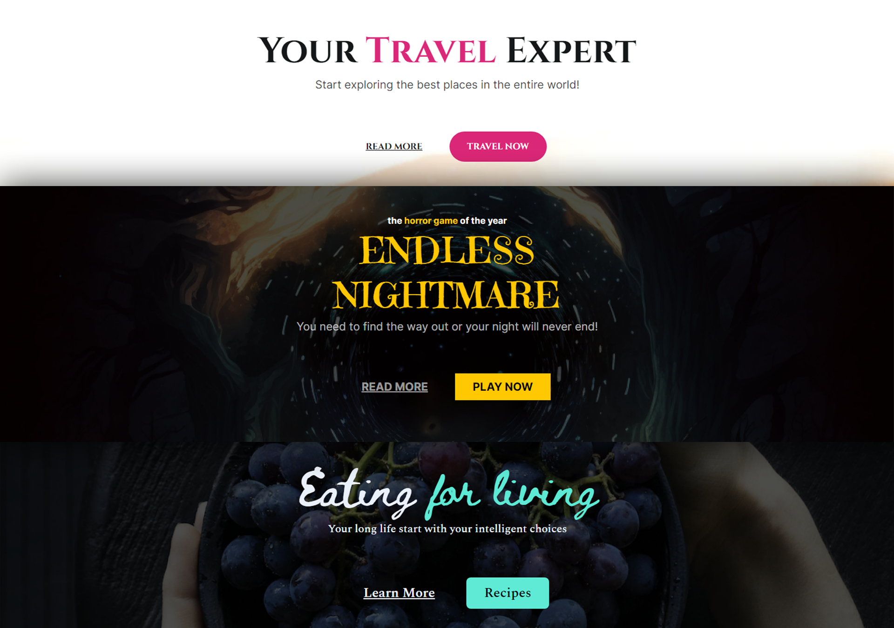

<h1 align="center"><strong>Jornada Primeira Vaga</strong></h1>

Um evento feito para quem tem pouco ou nenhum conhecimento em programação e deseja dar o primeiro passo para acessar um mercado com milhares de oportunidades disponíveis, vagas de trabalho remotas e salários iniciais entre R$ 2.000 e R$ 4.000.  

  <a href="#-tecnologias">Tecnologias</a>&nbsp;&nbsp;&nbsp;|&nbsp;&nbsp;&nbsp;
  <a href="#-projeto">Projeto</a>&nbsp;&nbsp;&nbsp;|&nbsp;&nbsp;&nbsp;
  <a href="#-layout">Layout</a>&nbsp;&nbsp;&nbsp;|&nbsp;&nbsp;&nbsp;
  <a href="#-licença">Licença</a>

  

 

  

## 🚀 Tecnologias

Esse projeto foi desenvolvido com as seguintes tecnologias:

- HTML e CSS
- Git e Github
- Figma

## 💻 Projeto

Nele foram criadas 3 Landing Pages para sites fictícios.
- O Endless Nightmare: Uma LP para o lançamento de um jogo de terror.
- O Travel Expert: Uma LP para um site de viagens.
- O Healthy Recipes: Uma LP para um site de receitas.

<strong> [Visite o projeto online](guiogigo.github.io/Jornada) </strong>

## 🔖 Layout

Você pode visualizar o layout do projeto através [DESSE LINK](https://www.figma.com/file/MczOIV8asdnpw6etqQLR7y/Horror-Game-LP-(Community)?node-id=109-23&t=SI0R7hifUDziROXi-0). É necessário ter conta no [Figma](https://figma.com) para acessá-lo.

## 📝 Licença

Esse projeto está sob a licença MIT.

---

Feito com ♥ by Guilherme Batista 👋 [Participe da nossa comunidade!](https://discord.gg/rocketseat)
